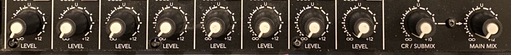
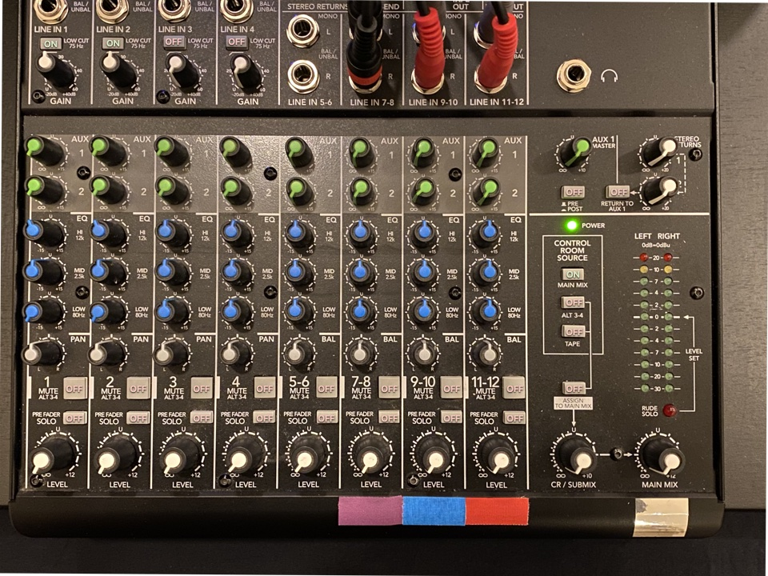

# South Bay Fusion Audio Setup

### 1. Remove Equipment

Remove the following equipment from our storage area:

* 1x "Audio Rack"
* 1x Folding table
* 1x Black tablecloth
* 4x Behringer B212D speakers
* 2x speaker stands
* 4x XLR cables
* 4x Power cables

### 2. Set up DJ Booth

Set up the folding table on the west side of the room. Add the tablecloth. Center with the wall segment between the entryway and closet door. Center with the stage stairs.

 

Place Audio Rack on the table edge nearest the stage. Unwind power cables and audio input cables.

 

### 3. Prepare Speakers

On the back side of each speaker, set the following settings:

* LEVEL to 10 o' clock
* HIGH to 12 o'clock (straight up)
* LOW to 12 o'clock (straight up)
* POWER to OFF

Each knob should have yellow guide lines. Simply align the yellow lines.

### 4. Prepare Stands

Expand the two speaker stands using the yellow guide lines. 

 

Ensure that the safety pin is in place and most knobs are tightened. One knob is completely broken, but the safety pin should keep the stand upright. The other knobs are fragile (don't overtighten).

### 5. Place Front Speakers

Face the stage. Place Speaker A on the right (east) side.

Place Speaker B on the left (west) side. Both speakers should "target" the window on the south side of the room. This is not an ideal placement, but it's the best we can do with our current equipment.

### 6. Place Rear Speakers

Find the emergency exit on the east side of the room. There is a window to the immediate south. Place the stand such that the center pole is in line with the southern edge of the window. Place Speaker C on top of the stand.

Place Speaker D on the opposite side of the room. Roughly align to Speaker C. Note that Speaker D is falling apart: feet are missing, the grill is bent, and the XLR input is damaged. Please be gentle with Speaker D.

### 7. Run speaker cables

*Important: All speakers must be powered down during this step.*

Locate the following four XLR cables:

| Target Speaker | Strap Color   | Length   | 
| -------------- | ------------- | -------- |
| A              | Red           | 65 feet  |
| B              | Orange        | 50 feet  |
| C              | Yellow        | 150 feet |
| D              | Green         | 50 feet  |

Run cables A, B, and C through the stairwell posts near the DJ booth:

Run cables A and B along the stage to their corresponding speaker. Run cable C to the stairwell on the opposite side of the room and through the posts. Utilize the hooks near the stairwell:

Continue running cable C over the emergency exit door, again utilizing the hooks:

Find the remaining two hooks near the window. Run cable through them and into Speaker C:

Run cable D over the entryway and to Speaker D:

 

### 9. Initialize system

*Important: All speakers must be powered down until the end of this step.*

Return to the DJ Booth. Plug each XLR connector into its corresponding socket on the back of the audio rack.
Set the following on the mixer:

* Each LEVEL knob to ∞
* MAIN MIX knob to ∞.

Proceed to power on the system as follows:

* Plug in the audio rack and turn on the power switch in the top-right corner.
* Run power cables from each speaker to the nearest outlet.
* Power on all four speakers.

**IMPORTANT:** From this point on, no equipment may be powered on without first powering off the speakers. Additionally, the LEVEL knob *MUST* be set to ∞ when connecting to or disconnecting from a channel.

### 10. Configure Mixer

First, ensure the following global settings:

* Each PRE FADER SOLO is OFF (up position, depressed). When one of these are on, the "RUDE SOLO" light blinks.
* CONTROL ROOM SOURCE is set to MAIN MIX only (down position), the other two buttons are OFF.
* ASSIGN TO MAIN MIX is OFF.
* CR/SUBMIX is ∞.
* STEREO RETURNS are both ∞.

Before playing music on a stereo channel, ensure the following channel settings:

* BAL/HI/MID/LOW knobs are centered (straight up).
* MUTE switch is OFF (up position, depressed).
* LEVEL is near U.
* MAIN MIX is near U.

Before using a microphone, ensure the following channel settings:

* LOW CUT is ON (down position, pressed).
* GAIN is 30 (straight up).
* HIGH is -3dB (11 o'clock).
* MID is U (straight up)
* LOW is -15dB (7 o'clock).
* PAN is centered (straight up).
* MUTE switch is OFF (up position, depressed).
* MAIN MIX is near U.

When not playing audio, LEVEL and MAIN MIX should be kept at ∞. Here is a fully-configured mixer in the non-playing scenario:

